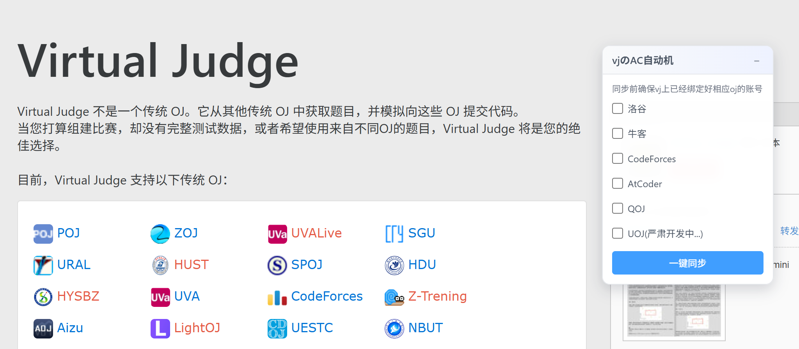

 **简体中文 | [English](doc/README_en.md)**

# VJudge の AC自动机

本工具用于 **一键同步 VJudge 上已绑定的其他 OJ 数据**，  
方便统一统计个人的过题情况与做题进度。

持续更新中...

## 当前支持的功能

- [x] 洛谷
- [x] Codeforces
- [x] AtCoder
- [x] QOJ
- [x] 牛客(未完善)
- [x] UOJ

- [ ] AC代码一键同步远程仓库
- [ ] 浏览器插件版本

## 快速使用

### 可归档OJ(除了牛客)
**在VJudge上绑定过账号就可以实现一键同步**

1. 安装好脚本,进入VJudge网站,旁边会出现一个面板
2. 勾选要同步的OJ,点击"一键同步"即可
3. 要停止同步,刷新页面即可(终止功能懒得写了)

### 不可归档OJ(目前只有牛客)

目前问题较多,暂不建议同步
(会出现速率限制,题目不存在等问题,等后续版本解决)

## 一键获取

**[项目地址](https://github.com/Tabris-ZX/vjudge-sync)**

### 油猴脚本下载
**[点击此处一键下载脚本](https://greasyfork.org/zh-CN/scripts/559149-vjudge%E3%81%AEac%E8%87%AA%E5%8A%A8%E6%9C%BA)**

### 浏览器插件下载
**严肃开发中...**

## 数据来源说明

AtCoder 数据由以下项目提供支持，感谢大佬：
- https://github.com/kenkoooo/AtCoderProblems

### 🌟 如果这个项目对你有帮助，请给个 Star！
**有任何问题欢迎来提issue!**

