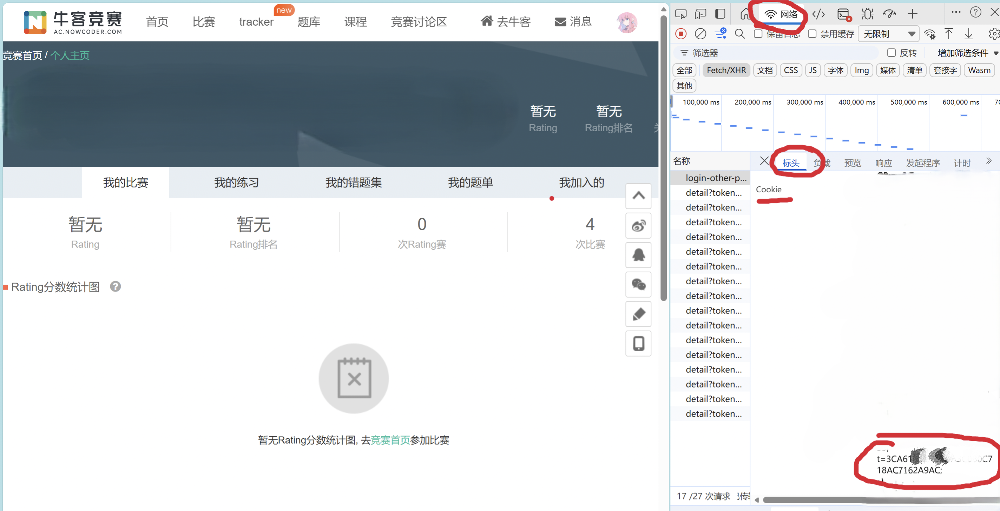

# VJudge の AC自动机

本工具用于 **一键同步 VJudge 上已绑定的其他 OJ 数据**，  
方便统一统计个人的过题情况与做题进度。

持续更新中...
## 当前支持的 OJ

- [x] 洛谷
- [x] Codeforces
- [x] AtCoder
- [x] QOJ
- [x] 牛客
- [ ] UOJ

## 快速使用

### 可归档OJ(除牛客)
**在VJudge上绑定过账号就可以实现一键同步**

### 不可归档OJ(牛客)
**在VJudge上绑定账号,并且在面板上填写token可用**

#### token获取方法
1. 按F12 → 选择Network(网络)面板
2. 刷新页面或触发操作
3. 随便点一个请求,找到Cookie字段
4. token就是cookie中`t=`开头的值

## 一键获取
### 油猴脚本下载
**[点击此处一键下载脚本](https://raw.githubusercontent.com/Tabris-ZX/vjudge-sync/main/Tampermonkey/vjudge-sync.user.js)**

### 浏览器插件下载
**严肃开发中...**

## 数据来源说明

AtCoder 数据由以下项目提供支持，感谢大佬：
- https://github.com/kenkoooo/AtCoderProblems

### 🌟 如果这个项目对你有帮助，请给个 Star！
**有任何问题欢迎来提issue!**

